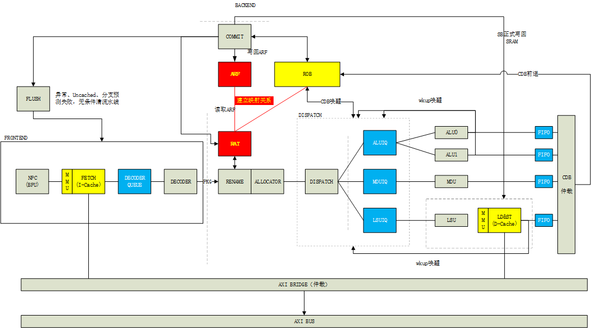
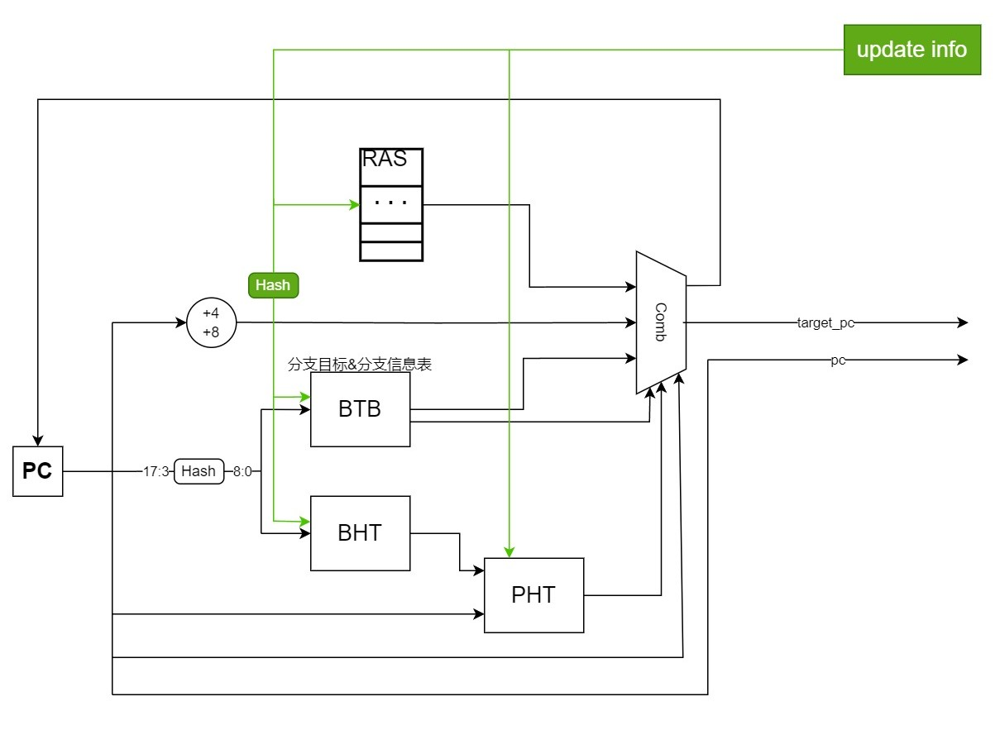
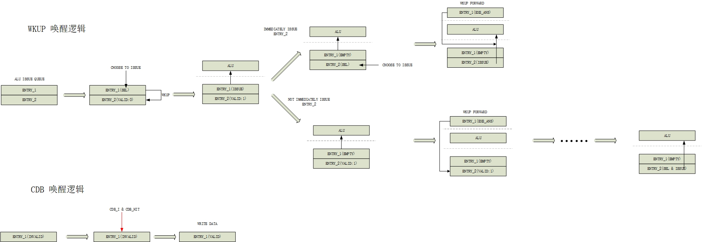

# “龙芯杯”第七届全国大学生计算机系统能力培养大赛 - 初赛设计报告
——北京航空航天大学 2 队 - BOOM

## 目录
- 一、CPU 内核设计
  - 1.1 总体设计
    - 1.1.1 前端 Frontend
    - 1.1.2 后端 Backend
    - 1.1.3 访存 Memory
  - 1.2 分支预测 Branch Predict
  - 1.3 取指 Inst Fetch
  - 1.4 译码 Decoder
  - 1.5 寄存器重命名 Rename
  - 1.6 分发 Dispatch
  - 1.7 发射 Issue
  - 1.8 执行 Execute
    - 1.8.1 算术逻辑指令 ALU
    - 1.8.2 乘除指令 MDU
    - 1.8.3 访存指令 LSU
  - 1.9 转发 CDB
  - 1.10 重排序 Re-ordered
  - 1.11 提交 Commit
    - 1.11.1 异常处理 Exception
    - 1.11.2 cache逻辑 D-Cache
- 二、SoC 与外设实现
  - ???
- 三、系统软件支持
  - ???

## 一、CPU 内核设计

### 1.1 总体设计

### 1.2 分支预测 Branch Predict

BOOM 分支预测器实现了单周期的局部历史预测。如图<!-- TODO: 图几？ -->，BOOM分支预测器会根据程序计数器 hash 的结果查找 BTB 以及 BHT，并利用查找到的 history 与 PC 的低位拼接作为地址查找饱和计数器表。在右侧的组合逻辑选择器中，BOOM 分支预测器会根据从 BTB 中读取到的当前指令信息、饱和计数器信息以及 `pc[2]` 作为判断条件，从下一条 PC、RAS 以及 BTB 中选择合适的值作为下一 PC。

在判断是否跳转上，考虑到 BOOM 为双发射乱序处理器，其指令预测块大小也为 2。此外，由于BOOM 的取指级只允许按照 8 字对齐进行两条指令的取址，因此，在判断的过程中，除了需要使用到从 BTB 表中读取出来的指令信息和饱和计数器的值以外，还需要根据当前 PC 的低三位对 PC 的奇偶性进行判断，并在前一条指令为跳转指令且预测为跳转的时候将后一条指令置无效。BPU 级会计算出两条指令的有效性，并用两位的掩码 mask 通知下一流水级指令的有效性。

在更新方面，BOOM <!--在 BPU中以及 Commit 级两个位置--> 仅在 Commit 级对分支预测表项进行更新，<!--优先级依次递增，保证分支预测器能够尽早得到准确信息-->以保证分支预测表项的正确性。

在参数设置方面，BOOM 分支预测器的 BTB 与 BHT 共有 $2^{10}$ 项表项，PHT 有 $2^{13}$ 项表项，局部历史有 5 位。局部历史的长度为 12 。RAS 的深度为 16。表项定义如下：

| bit | [40:35] | [34:33] | [32:1] | [0:0] |
| :---: | :---: | :---: | :---: | :---: |
| BTB entry | tag | branch_type | target_pc | valid |

| bit | [4:0] |
| :---: | :---: |
| BHT entry | history |

| bit | [1:0] |
| :---: | :---: |
| PHT entry | 两位饱和计数器 **scnt** |

### 1.3 取指 Inst Fetch

### 1.4 译码 Decoder

BOOM 处理器流水级较深。当后端阻塞时前端的指令会被阻塞到前端的解码级。为了充分利用前端的硬件资源，BOOM 处理器在解码级前后设置了两个深度可配置的 FIFO 用于存储被阻塞的指令以加速处理器的运行。

### 1.5 寄存器重命名 Rename

### 1.6 分发 Dispatch

### 1.7 发射 Issue

### 1.8 执行 Execute

#### 1.8.1 算术逻辑指令 ALU
    
#### 1.8.2 乘除指令 MDU

#### 1.8.3 访存指令 LSU

### 1.9 转发 & 唤醒 CDB

### 1.10 重排序 Re-ordered

### 1.11 提交 Commit

### 1.12 异常终端 Exception

## 二、SoC 与外设实现

## 三、系统软件支持