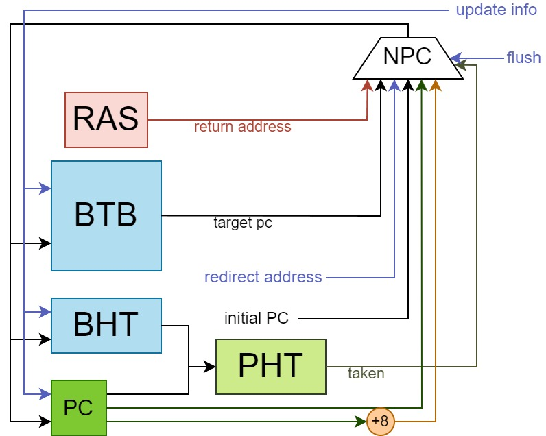

# “龙芯杯”第七届全国大学生计算机系统能力培养大赛 - 初赛设计报告
——北京航空航天大学 2 队 - BOOM

## 目录
- 一、CPU 内核设计
  - 1.1 总体设计
    - 1.1.1 前端 Frontend
    - 1.1.2 后端 Backend
    - 1.1.3 访存 Memory
  - 1.2 分支预测 Branch Predict
  - 1.3 取指 Inst Fetch
  - 1.4 译码 Decoder
  - 1.5 寄存器重命名 Rename
  - 1.6 分发 Dispatch
  - 1.7 发射 Issue
  - 1.8 执行 Execute
    - 1.8.1 算术逻辑指令 ALU
    - 1.8.2 乘除指令 MDU
    - 1.8.3 访存指令 LSU
  - 1.9 转发 CDB
  - 1.10 重排序 Re-ordered
  - 1.11 提交 Commit
    - 1.11.1 异常处理 Exception
    - 1.11.2 cache逻辑 D-Cache
- 二、SoC 与外设实现
  - ???
- 三、系统软件支持
  - ???

## 一、CPU 内核设计

### 1.1 总体设计

### 1.2 分支预测 Branch Predict

BOOM 分支预测器实现了单周期的局部历史预测。如图<!-- TODO: 图几？ -->，BOOM分支预测器会根据程序计数器 hash 的结果查找 BTB 以及 BHT，并利用查找到的 history 与 PC 的低位拼接作为地址查找饱和计数器表。在右侧的组合逻辑选择器中，BOOM 分支预测器会根据从 BTB 中读取到的当前指令信息、饱和计数器信息以及 `pc[2]` 作为判断条件，从下一条 PC、RAS 以及 BTB 中选择合适的值作为下一 PC。

在判断是否跳转上，考虑到 BOOM 为双发射乱序处理器，其指令预测块大小也为 2。此外，由于BOOM 的取指级只允许按照 8 字对齐进行两条指令的取址，因此，在判断的过程中，除了需要使用到从 BTB 表中读取出来的指令信息和饱和计数器的值以外，还需要根据当前 PC 的低三位对 PC 的奇偶性进行判断，并在前一条指令为跳转指令且预测为跳转的时候将后一条指令置无效。BPU 级会计算出两条指令的有效性，并用两位的掩码 mask 通知下一流水级指令的有效性。

在更新方面，BOOM <!--在 BPU中以及 Commit 级两个位置--> 仅在 Commit 级对分支预测表项进行更新，<!--优先级依次递增，保证分支预测器能够尽早得到准确信息-->以保证分支预测表项的正确性。

在参数设置方面，BOOM 分支预测器的 BTB 与 BHT 共有 $2^{10}$ 项表项，PHT 有 $2^{13}$ 项表项，局部历史有 5 位。局部历史的长度为 12 。RAS 的深度为 16。表项定义如下：

| bit | [40:35] | [34:33] | [32:1] | [0:0] |
| :---: | :---: | :---: | :---: | :---: |
| BTB entry | tag | branch_type | target_pc | valid |

| bit | [4:0] |
| :---: | :---: |
| BHT entry | history |

| bit | [1:0] |
| :---: | :---: |
| PHT entry | 两位饱和计数器 **scnt** |

### 1.3 取指 Inst Fetch

### 1.4 译码 Decoder

BOOM 处理器流水级较深。当后端阻塞时前端的指令会被阻塞到前端的解码级。为了充分利用前端的硬件资源，BOOM 处理器在解码级前后设置了两个深度可配置的 FIFO 用于存储被阻塞的指令以加速处理器的运行。

### 1.5 寄存器重命名 Rename

### 1.6 分发 Dispatch

BOOM 的整数执行部分共有4个执行单元，具体为2个ALU，1个1访存部件LSU（集成了StoreBuffer），一个乘除单元MDU。

每个执行单元均有1个缓存指令的队列。在具体的容量大小上，ALU的队列深度为4，LSU和MDU的队列深度均为8。对于MDU，由于除法器采用了固定32周期的设计，考虑到可能的高阻塞情况，将深度设置为了较大的8。

对于保留站的存入指令情况，在ALU和MDU、LSU的执行逻辑上执行了差异设置：
- ALU：每个周期仅能存入一条指令。两个ALU只有在分别接受目的寄存器编号不同的奇偶值的情况。由于重命名寄存器的分配逻辑，大部分时候分发的两条指令都会分别送入两个ALU执行队列。这在整体时序上是可以接受的。
- MDU：每个周期至多送入两条指令，但至多只能选择一条执行，另一条保留在执行站中。
- LSU：每个周期至多送入两条指令，但至多只能选择一条执行，另一条保留在执行站中。

并且，由于BOOM采用了双发射设计，为了整体取值、执行上的平衡，采用了仅当两条指令都能送入保留站时，才会将两条指令都送入保留站中。
如果仅有一条指令可送入保留站，则不会送入。这种情况可能出现在某条指令对应的保留站满的情况下。

### 1.7 发射 Issue

在发射逻辑上：
- ALU：采用Aging算法，选择最早存入的、就绪的指令发射。支持乱序发射
- MDU、LSU：采用了FIFO设计，完全为顺序执行。由于访存指令和乘除指令的相应占比，这在整体时序上是可以接受的。

对于发射，支持指令的背靠背WakeUp唤醒以及通用总线CDB唤醒。
- WakeUp唤醒：对于形如`add $1, $2, $3;  add $2, $1, $3`的两条指令，当前一条指令被唤醒时，会发出相应的WakeUp总线信号，下一条指令监听总线上相应的寄存器编号`reg_id`和数据有效信息`valid`信号。当监听成功时，会将指令送入保留站中，进行发射。但此时前一条指令的数据还没生成，需要严格依赖时序监听后续产生的数据。
- CDB唤醒：当ROB进行提交写寄存器时，会发出相应的CDB总线信号。在保留站中的指令会监听相应的寄存器编号`reg_id`、数据有效信息`valid`信号、数据`data`。当监听成功时，会将指令送入保留站中，进行发射。此时数据已经就位，可以正常执行。

### 1.8 执行 Execute

执行单元共有三类四个：2个整数运算单元ALU、1个访存单元LSU、1个乘除执行单元MDU。

#### 1.8.1 算术逻辑指令 ALU

ALU是单周期的。进行绝大部的整数计算。包括一般计算、移位、逻辑运算等。ALU的结果包括了分支指令时候跳转。

#### 1.8.2 乘除指令 MDU

分为乘法器和除法器。

乘法器采用了封装好的IQ。

除法器采用了自主设计的固定32周期除法器。
之所以选定该设计，是考虑到整体指令中除法指令占比极少，32周期的高延迟带来了较大的频率提升，在此处进行了取舍。

#### 1.8.3 访存指令 LSU

LSU是和DCache进行交互的元件。包含了StoreBuffer。

对LSU的访问是单周期的，并不会进行阻塞操作。
- 对于读指令：如果Cache-hit，则会直接读Cache或StoreBuffer得到数据，并继续向后执行
- 对于写指令：如果Cache-hit，则会将相应的请求写入StoreBuffer中，并继续向后执行
- 对于Cache-miss的情况，并不会在此处进行重填，而是将状态机放在了提交commit进行处理。指令会在此处标记缺失，并继续向后执行。

该级读出了DCache中相应的命中、缺失信息，传递至提交级进行处理。

在提交级，同样会像LSU发送请求，进行StroeBuffer中数据的提交。

### 1.9 提交 Commit

提交级是较复杂的级别，主要进行的操作有：
1. 指令提交
2. 对分支预测结果进行更新，并发送至BPU
3. 特权指令处理，进行CSR维护、Cache维护、TLB维护等
4. 对于之前访存缺失的情况，进入状态机，发起AXI请求，进行数据请求

指令流执行的结果由ROB提交至Commit单元，进行提交的判断和退休处理。

提交级首先判断ROB尾指针指向的两条指令是否能提交，每拍最多退休两条指令。仅当首条指令提交时允许第二条指令提交。此外，对于特殊指令、分支预测失败指令、例外指令、cache缺失的访存指令、强序非缓存的访存指令等由于需要进行特殊处理的指令，仅允许单条退休。

提交级进行了ARF写回、CSR维护、TLB维护和例外处理。对于需要写寄存器的指令，在提交级将其正式写入体系结构寄存器。commit级维护了CSR寄存器，对CSR读写都在提交级进行，为了解决数据冒险，所有CSR指令提交时都清空流水线。其中由于取指、访存和提交级都需要对TLB表项进行维护，为了降低复杂度，提交级维护了一个单独的JTLB，而取指级和访存级分别维护了ITLB和DTLB作为提交级TLB的副本。取指和访存级的TLB都只进行读和查询操作，由提交级负责维护每个TLB的写入，保证数据一致性；因此TLB维护指令也需要清空管线；执行流遇到例外时，提交级修改CSR寄存器，并跳转到异常入口。

处理器采用了一种“遇事不决刷流水”的操作，对于可能影响运行正确性的大部分操作都进行了刷流水的操作。对CSR访问指令、TLB维护指令、CACHE维护指令、ertn和idle指令，和例外、分支预测失败、cache缺失的情况都清空了流水线。

由于提交级的逻辑较为复杂，我们使用了两个流水级来实现提交。第一个流水级通过整合指令执行信息、例外信息、分支预测信息等决定将要退休的指令，同步进行了退休信息的计算。第二个流水级正式进行对CSR寄存器、TLB和ARF进行写入操作，并决定是否刷新管线。如果遇到特殊操作（如需要进入访存状态机），则进入第二个流水级。

## 二、SoC 与外设实现

## 三、系统软件支持